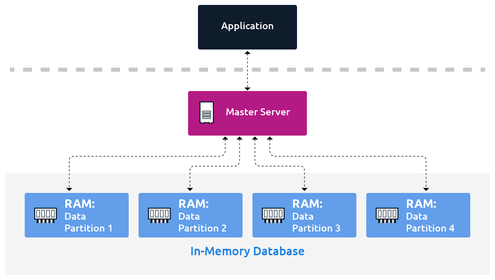
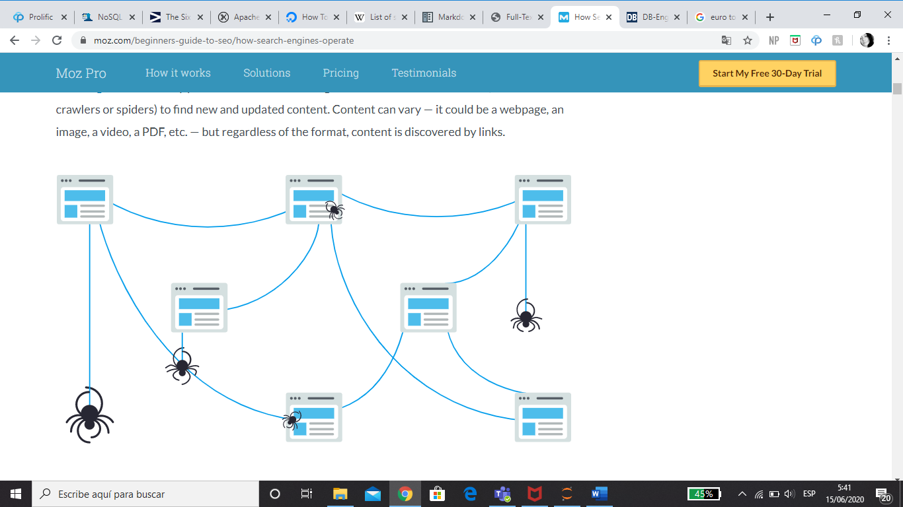
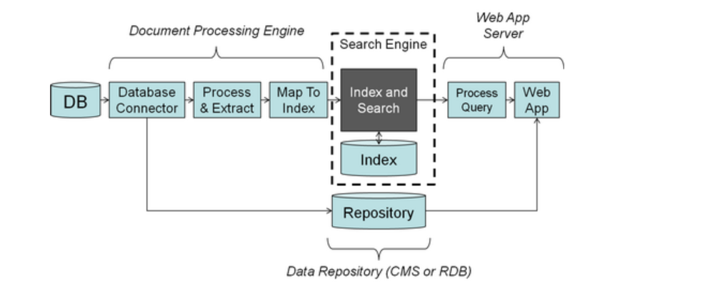

# DATABASES CLASSIFICATION  

>> Introduction:
The following script shows three different types of useful databases which are mainly focused on big data-related work.

---

### Team: 
- Lisette Ruiz: https://github.com/Lisette-Ruiz/Big_Data_Managment_2020/blob/master/Data%20Bases/In_memory_DB.md
- Monse Valbuena: https://github.com/yamilivalbuena/Big_Data/blob/master/Databases/Search_DB.md 
- Héctor Hernández: https://github.com/hectorartoken/Big-Data-Hector/blob/master/Time-Series.md

### Content:

- [In-memory databases](#In-memory-databases)
  * [Matrix](#Matrix-in-memory-databases)
- [Search-engine databases](#Search-engine-databases)
  * [Matrix](#Matrix-search-engine-databases)
- [Time-series databases](#Time-series-databases)
  * [Matrix](#Matrix-time-series-databases)
- [References](#References)

# In-memory-databases 

***

### What is an In-memory Databases ? 

 : They stores computer data in a computer’s main memory instead of a disk drive to produce quicker response times. On other words, they keep all its data in the random access memory (RAM) of a computer. Only the main memory is accessed when querying data. This allows for faster access of that data than a disk-based system.

 - - -

### In-memory are made for: 

 : In-memory databases are ideal for applications that require microsecond response times and can have large spikes in traffic at any time, such as game leaderboards, session stores, and real-time analytics. 

 ***

### Properties of In-memory Database Systems 

- **Atomicity** : this involves a single data transfer and avoids the optimized processing of multiple data transfers. Every transaction is "all or nothing". 
- **Consistency**: This ensures that the data exists in a consistent and valid state that complies with all defined data existence rules. 
- **Isolation**: It ensures that each transaction runs in total isolation and is completely independent of any other concurrent transactions. 
- **Durability**: It ensures the completion of a transaction once assigned, even in the event of power loss, crashes, or errors. 

 - - -
 ### How Does an In-Memory Database Work?
 
 : Data storage in an in-memory database relies on a computer’s random access memory (RAM) or main memory instead of traditional disk drives. Data is loaded into an in-memory database in a compressed and non-relational format. The data is in a directly usable format without the barrier of compression or encryption. It allows for direct navigation from index to row or column and is a read-only system.

The speed of an in-memory database is made possible by lack of translation and caching. The data is used in the same form as the application that contains it. Data access is managed by an in-memory database management system.

An in-memory database system can also act as an read-only analytic database that stores historical data on metrics for business intelligence (BI) applications. This eliminates data indexing, which can reduce IT costs. Multi-core servers, 64-bit computing and lower RAM prices have made in-memory analytics more common.

***

### Advantages of In-memory Database Systems.

1. An in-memory database system streamlines processing by eliminating multiple data transfers, reduces memory consumption by removing multiple copies of data, and simplifies processing by minimizing CPU demands. 

2. __The major advantage of systems using in-memory databases vs traditional database systems is: its performance speed.__ 

3. Source data is loaded into the system memory in a compressed and  format. Therefore, in-memory processing reduces disk seek time for accessing data and streamlining the work involved in processing queries. 

4. The internal optimization algorithms for in-memory databases are simpler and execute fewer CPU instructions, thereby facilitating faster response times than disk-optimized databases. 

5. In-memory databases allow for real-time analysis and reporting of data.

***

## MATRIX-IN-MEMORY-DATABASES

Comparation between 4 in-memory databases:

 |   | Redis | Kinetica | Apache Ignite | Oracle RDBMS 
-- | -- | -- | -- | -- |
**Client interface** | C, C++, Python, Lua, C# | C++, C#, Java, JavaScript, Node.js. Python, HTTP | Java, SQL, JDBC, ODBC | 
**License** |	Open Source (BSD) | Proprietary | Open Source (Apache License Version 2.0) | Proprietary
**Best Used** | Resolve very complex programming problems with simple commands executed within the data store, reducing coding effort, increasing throughput, and reducing latency. | Kinetica is an ideal solution for data discovery projects. | It was designed to store and compute on large volumes of data across a cluster of nodes.| It provides database introspection and various instruments for creating and modifying objects for the supported engines.
**Main focus** | It scales horizontally and provides ACID transactions. | An analytics platform designed to handle extremely large and complex datasets with ease. | Scaled horizontally, it distributes key-value pairs across the cluster. Data is rebalanced every time a node is added/removed from the cluster. | First database designed for enterprise grid computing. the most flexible and cost-effective way to manage information and applications
**Acronym**  | Remote Dictionary Server |   |  | Oracle Relational database management system.
**Developer** | Redis Labs | Kinetica (formerly GIS Federal) | Apache Software Foundation, GridGain Systems | Oracle Corporation
**Consistency** | It is networked, in-memory, and stores keys with optional durability. | Functions like a RDBMS (structured data) for fast analytics on datasets in the hundreds of GBs to 10's of TBs range. | Durable, strongly consistent, and highly available with powerful SQL, key-value and processing APIs. | RDBMS Oracle 12c contains an option for in-memory technology (additional licenses required).
**Platforms** | Written in ANSI C and works in most POSIX systems like Linux, *BSD, OS X. | GPU-Accelerated Database. | Apache is a platform designed to store and compute on large volumes of data across a cluster of nodes. | Make market-leading components (databases, application servers, web servers, which lets customers to implement PeopleSoft on the infrastructure.

--- 

# Search-engine-databases

---

### What is a search-engine database?

A search-engine database is a type of nonrelational database that is dedicated to the search of data content. Search-engine databases use indexes to categorize the similar characteristics among data and facilitate search capability. Search-engine databases are optimized for dealing with data that may be long, semistructured, or unstructured, and they typically offer specialized methods such as full-text search, complex search expressions, and ranking of search results. 

---

### How is a search-engine database different from a relational database?

 Search engines deal with data that does not conform to the rigid structural requirements of relation databases. Data for search may be long, semi-structured or unstructured. A search engine is primarily an index and not that great as repository for data storage. Further, the “RDBMS ecosystem” (development tools, processes, techniques, typical approaches to solutions, etc.) are generally not that useful for search engines. 
 
---

### Features of a search-engine database

- Support for complex search expressions
- Full text search
- Stemming (reducing inflected words to their stem)
- Ranking and grouping of search results
- Geospatial search
- Distributed search for high scalability

---
### Use cases

**Text search**

Search-engine databases can handle full-text search faster than relational databases. For example, an e-commerce website can use search-engine databases to provide instant autocompletes or suggestions for its customers. Search-engine databases can sort relevant results based on characteristics such as name, price, category, or release data, and display the results in a structured view. 

**Logging and analysis**

Maintaining larger applications that are either distributed across several nodes or consist of several smaller applications searching for events in log files can become tedious. Search-engine databases can handle the logging more efficiently. You can centralize your logs from different applications by indexing them using a search-engine database. For example you can see the logs of your Apache web server combined with the log files of your application server. Because all the information is available in real time, you can implement a visual representation of what is happening in your system in real time, which can help you to find problems more quickly. 

---

### Primary functions 

- **Crawl**: Scour the Internet for content, looking over the code/content for each URL they find.
- **Index**: Store and organize the content found during the crawling process. Once a page is in the index, it’s in the running to be displayed as a result to relevant queries.
- **Rank**: Provide the pieces of content that will best answer a searcher's query, which means that results are ordered by most relevant to least relevant.

*Source: https://moz.com/beginners-guide-to-seo/how-search-engines-operate *

---

#### What is search engine crawling?

Crawling is the discovery process in which search engines send out a team of robots (known as crawlers or spiders) to find new and updated content. Content can vary — it could be a webpage, an image, a video, a PDF, etc. — but regardless of the format, content is discovered by links.

---

#### What is a search engine index?

Search engines process and store information they find in an index, a huge database of all the content they’ve discovered and deem good enough to serve up to searchers.

---

#### What is search engine ranking?

When someone performs a search, search engines scour their index for highly relevant content and then orders that content in the hopes of solving the searcher's query. This ordering of search results by relevance is known as ranking. In general, you can assume that the higher a website is ranked, the more relevant the search engine believes that site is to the query.

---

### Integration of a search engine 

The search engine does indexing and search, and other parts of the application are handled using more appropriate tools:

- **Document Processing Engine**: For content acquisition and metadata normalization. These tools can handle high volume document processing, parsing, extraction, and other tasks. They tend to be much more flexible and have easier deployment strategies than putting this into the search engine itself.
- **Repository**: Search engines are not good at document or data storage. An outside database (Content Management System and/or Relational Database) would better serve this function.
- **Web Application Server**: The end-user application tools provided by search engines are fine for simple user interfaces, but will likely disappoint for most UI customization tasks. Most users quickly outgrow these tools.

*source: https://www.searchtechnologies.com/blog/six-search-engine-commandments *

---
## Matrix-search-engine-databases

|            |Elasticsearch | Solr | Sphinix |
|----------- |--------------|------|---------|
|Use example | The speed and scalability of Elasticsearch and its ability to index many types of content mean that it can be used for a number of use cases:Application search, Website search, Enterprise search, Logging and log analytics, Infrastructure metrics and container monitoring, Application performance monitoring, Geospatial data analysis and visualization, Security analytics, Business analytics | Providing distributed indexing, replication and load-balanced querying, automated failover and recovery, centralized configuration Solr is designed for scalability and fault tolerance. Solr is widely used for enterprise search and analytics use cases | Sphinx can be used either as a stand-alone server or as a storage engine ("SphinxSE") for the MySQL family of databases. When run as a standalone server Sphinx operates similar to a DBMS and can communicate with MySQL, MariaDB and PostgreSQL through their native protocols or with any ODBC-compliant DBMS via ODBC. MariaDB, a fork of MySQL, is distributed with SphinxSE.|
|License|Parts of the software are licensed under various open-source licenses (mostly the Apache License), while other parts fall under the proprietary (source-available) Elastic License.|Licensed under the Apache License, Version 2.0.|The Sphinx Search server is dual-licensed; thus it can be either commercially licensed or freely available via the Downloads page if used in accordance with the terms of the GPL v.2.||Pricing|Free|Free|Free|
|Projects using it|Github|AT&T, Instagram,Buy.com, Ticketmaster, Netflix, The Echo Nest, Chegg, Disney, Adobe, eBay, IBM Websphere Commerce, Bloomberg, Comcast, MTV Networks, Travelocity|Craigslist.org, Recruitment.aleph-graymatter.com, Tradebit.com, vBulletin.com, Mediawiki Extension, Boardreader.com, OMBE.com, Limundo.com|
|Latest version| 6.8.10, June 2020|8.5.2, May 2020|Sphinx 3.2.1 (f152e0b; Jan 31, 2020)|
|Initial release date|February 2010|September 2008|2001|
|Consistency|Read consistency is eventually consistent but it can also be consistent|Eventual consistency||
|Data representation|JSON|JSON, XML, CSV or binary results|XML|
|Development Language|Java|Java|C++|
|API language|HTTP|HTTP|If Sphinx run as a stand-alone server, it is possible to use SphinxAPI to connect an application to it.|
|Features|Data rollups, index lifecycle management, Distributed search, Multi-tenancy, An analyzer chain, Analytical search, Grouping & aggregation|Full-text search, hit highlighting, faceted search, real-time indexing, dynamic clustering, database integration, NoSQL features and rich document (e.g., Word, PDF) handling|Batch and incremental (soft real-time) full-text indexing, Support for non-text attributes (scalars, strings, sets, JSON), Direct indexing of SQL databases. Native support for MySQL, MariaDB,PostgreSQL, MSSQL, plus ODBC connectivity, XML document indexing support, Full-text searching syntax, Database-like result set processing, Relevance ranking utilizing additional factors besides standard BM25|

---
---

# Time-series-databases

## Introduction 

Time-Series databases are designed to store data that chages with time.This can be any kind of data wich was collected over time.

Image extracted from:

## [What Is Time Series Data?](https://365datascience.com/time-series-data/)

Time series databases allow businesses to store time-stamped data.Time series databases are optimized for storing this data so that it can be easily 
pulled and analyzed. Time series data is often used when running predictive analytics or machine learning algorithms, enabling users to understand 
historical data to help predict future outcomes. Some big data processing and distribution software may provide time series storage functionality.

We can divide the Time Series Databases in 3 categories:

* Store data based on timestamps
* Consume data in real time
* Allow to easily pull the data for time series analysis

## Why use Time-Series?

**Predict future**: Make informed predictions about future events, observe real-time changes, and capture historical anomalies.

**Understand past**: Understand past data with a purpose-built database.

---

## Who uses Time Series?

**Database administrators**: Time series databases have grown in popularity since they are easier to implement, have greater flexibility, and tend to have 
faster data retrieval times. Database administrators use these tools to maintain and manage their time series data, ensuring it is properly stored.

**Data scientists**: As data science, including artificial intelligence, is fueled by data, it is key that this data is stored in the most effective and 
efficient manner. This ensures that the data can be queried and analyzed properly.

---

## Kinds of Time Series Database Software

**Relational databases**: Relational databases are traditional database tools used to align information into rows and columns. The structure allows for easy 
querying using SQL. Relational databases are used to store both simple information, such as identities and contact information, and complex information 
critical to business operations. They are highly scalable and can be stored on-premises, in the cloud, or through hybrid systems.

**NoSQL databases**: NoSQL databases such as graph databases are a great option for unstructured data. If the user needs to render a value that is easily found 
by its key, then a key-value store is the fastest and most scalable. The drawback is a much more limited querying ability, implying its limitations for 
analytic data. Conversely, rendering a user’s email address based on the username or caching web data is a simple and fast solution in a key-value store.

---

## Time Series Features

**Querying using time**: Time series databases allow users to query data using time, allowing them to search or analyze the data across a given time period, 
even by a fraction of a second.

**Data security**: Time series database solutions include data security features to protect the data stored by a business in its databases.

**Database creation and maintenance**: Time series databases software allows users to quickly create brand-new relational databases and modify them with ease.

**Scalability**: Times series database solutions grow with the data and is hence scalable, with the only pain point being physical or cloud storage capacity.

**Operating system (OS) compatibility**: Relational database solutions are compatible with numerous OS.

**Recovery**: Whether a database needs to be rolled back or outrightly recovered, some time series database solutions offer recovery features in the event any 
errors occur.

---

## Relationship to Big Data

Data has become the backbone of conducting business in the information age. As data drives business decisions and trends, it’s important that the data be 
digestible, easy to follow, and easy to reference. That’s why big data software mostly falls back on relational database solutions. Designed with strict organization, 
referencing, and referral in mind, relational databases absorb and store massive amounts of data to be later digested in the decision-making process.

---

# Matrix-time-series-databases

Comparation between 5 Time-Series databases:

Databases/Attributes | Amazon Timestream            | DataStax                      | InfluxDB                          | Prometheus                        | QuasarDB                          |
-------------------- | :--------------------------: | :---------------------------: | :-------------------------------: | :-------------------------------: | --------------------------------: |                         
**Market Segemnet**  | Mid-Market(56.3% of reviews) | Enterprise (61.5% of reviews) | Small-Business (52.4% of reviews) | Small-Business (47.4% of reviews) | Small-Business (33.3% of reviews) | 
**Unique Categories** | Amazon Timestream is categorized as Database as a Service (DBaaS) | DataStax is categorized as Data Replication, Database Monitoring, Database as a Service (DBaaS), Graph Databases, and Key-Value Stores | InfluxDB has no unique categories | Prometheus is categorized as Database Management Systems (DBMS) and Container Monitoring | QuasarDB has no unique categories |
**What is it?** | Amazon Timestream is a fast, scalable, fully managed time series database service for IoT and operational applications that makes it easy to store and analyze trillions of events per day at 1/10th the cost of relational databases. | DataStax helps companies compete in a rapidly changing world where expectations are high and new innovations happen daily. | InfluxDB is the open source time series database | An open-source service monitoring system and time series database. | QuasarDB is a high-performance, distributed time series database that seamlessly combines in-memory capabilities with reliable storage. It’s built on a vertical approach with a single software package that provides storage, distribution, standardization and analysis | 
**Pricing** | Free Trial Unavailable | Free Trial Unavailable | Free Trial Unavailable | Free Trial Unavailable | Free Trial Unavailable |
**Ease of Use** | 8.0 | 7.9 | 9.0 | 7.8 | 5.0 |
**Case of Use** | DevOps, Applications of IoT, Application Monitoring, Industrial Telemetry | Hybrid and Multi-cloud, Microservices, System Modernization, Streaming IoT, Analytics | Deep insights and analytics | Storage, visualizations, Integrations with Docker, HaProxy, StatsD and JMX metrics | import and export databases, Remote connectors with Grafana, Kafka, Spark, Excel and  Prometehus, APIs consults |
**Supoort** | Amazon web service | Apache Cassandra | Open Source | Open Source or Cloud Native | SQL |

## References

*In-memory databases*

- https://aws.amazon.com/es/nosql/in-memory/
- https://whatis.techtarget.com/definition/in-memory-database
- https://hazelcast.com/glossary/in-memory-database/
- https://raima.com/in-memory-database/

*Search-engine databases*

- https://aws.amazon.com/es/nosql/search/
- https://www.forbes.com/sites/metabrown/2018/03/31/get-the-basics-on-nosql-databases-search-engine-databases/#2607f14515b5
- https://db-engines.com/en/article/Search+Engines
- https://moz.com/beginners-guide-to-seo/how-search-engines-operate
- https://www.searchtechnologies.com/blog/six-search-engine-commandments

*Time-series databases*

- https://www.g2.com/categories/time-series-databases?utf8=%E2%9C%93&order=popular
